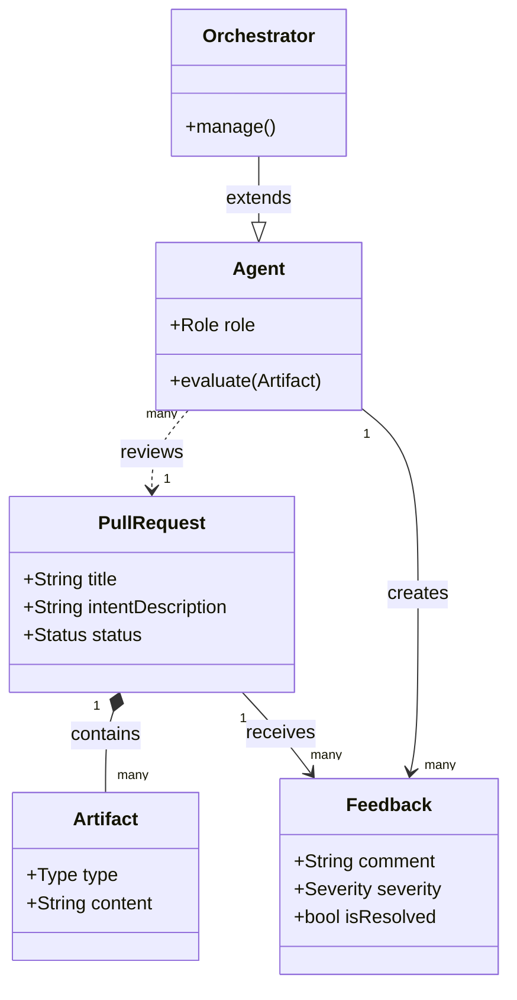

# Class Diagram

```mermaid
classDiagram
    class PullRequest {
        +String title
        +String intentDescription
        +Status status
    }
    class Artifact {
        +Type type
        +String content
    }
    class Agent {
        +Role role
        +evaluate(Artifact)
    }
    class Feedback {
        +String comment
        +Severity severity
        +bool isResolved
    }
    class Orchestrator {
        +manage()
    }
    
    PullRequest "1" *-- "many" Artifact : contains
    PullRequest "1" --> "many" Feedback : receives
    Agent "many" ..> "1" PullRequest : reviews
    Agent "1" --> "many" Feedback : creates
    Orchestrator --|> Agent : extends
```
